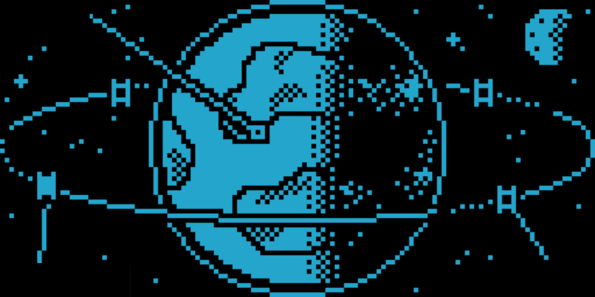
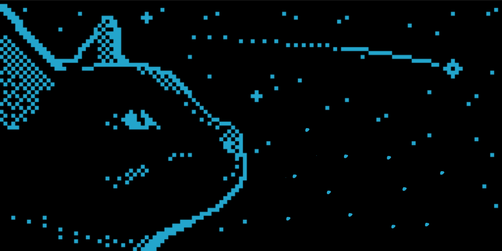

# NodeBridge

NodeBridge is an sshDevice based on the Raspberry Pi Pico that acts as a HID (Human Interface Device) USB emulator. Its primary function is to automatically open and navigate to a personal server's CasaOS dashboard when plugged into a computer.

## Product Gallery

*main*

*withPico*

*3dSketch*

## Project Overview

The project leverages the HID capabilities of the RP2040 (Raspberry Pi Pico) to simulate keyboard inputs. Upon connection, it triggers the Windows "Run" dialog (Win + R) and enters the specific URL for the CasaOS dashboard, providing a seamless "plug-and-play" access experience.

The device also features an OLED display that provides visual feedback through loading screens and status animations, enhancing the user experience during the connection process.

### CasaOS Interface

*CasaOS Login Page*

*CasaOS Dashboard*

## Project Structure

- **`usbEmulator/`**: Contains the core logic for the HID USB emulation.
- **`OLEDSketch/`**: Dedicated code for the SSD1306 OLED display animations and status screens.
- **`FinalSSH/`**: Combined implementation of HID emulation and OLED feedback.
- **`ByteImages/`**: Hexadecimal representations of the images used for the OLED display.
- **`.stl/`**: 3D model files for the custom enclosure.

## Setup Instructions

1. **Hardware Requirements:**
   - Raspberry Pi Pico (or any RP2040 board)
   - SSD1306 OLED Display (128x64, I2C)
   - Custom 3D printed case (find the model in `.stl/`)

2. **Software Installation:**
   - Install the Arduino IDE with the Raspberry Pi Pico board support.
   - Install the `U8g2` and `Keyboard` libraries.
   - Open `FinalSSH/FinalSSH.ino` and update the URL if necessary.
   - Upload the sketch to your Pico.

3. **Usage:**
   - Simply plug the device into any Windows-based machine.
   - Wait for the OLED loading screen to complete.
   - The device will automatically launch your default browser to the configured CasaOS dashboard.

## Credits

- **Visuals:** OLED status and loading screen animations were inspired by and utilize assets from [Moonbench](https://www.moonbench.xyz).
- **3D Design:** The custom enclosure model was designed by [dj.santos](https://makerworld.com/en/@dj.santos).

## License

This project is licensed under the MIT License - see the [LICENSE](LICENSE) file for details.
